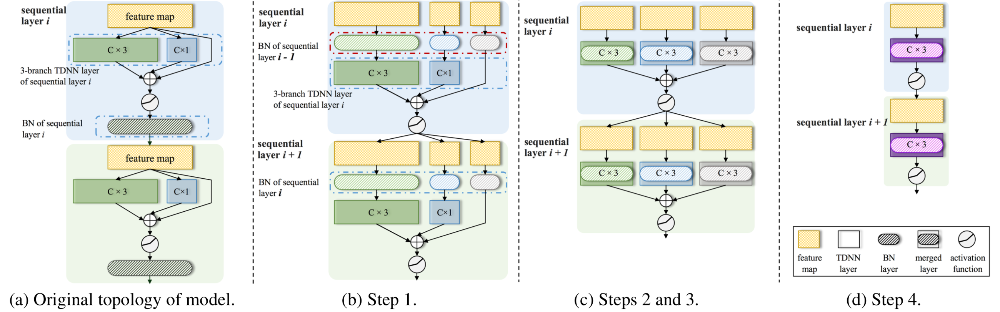
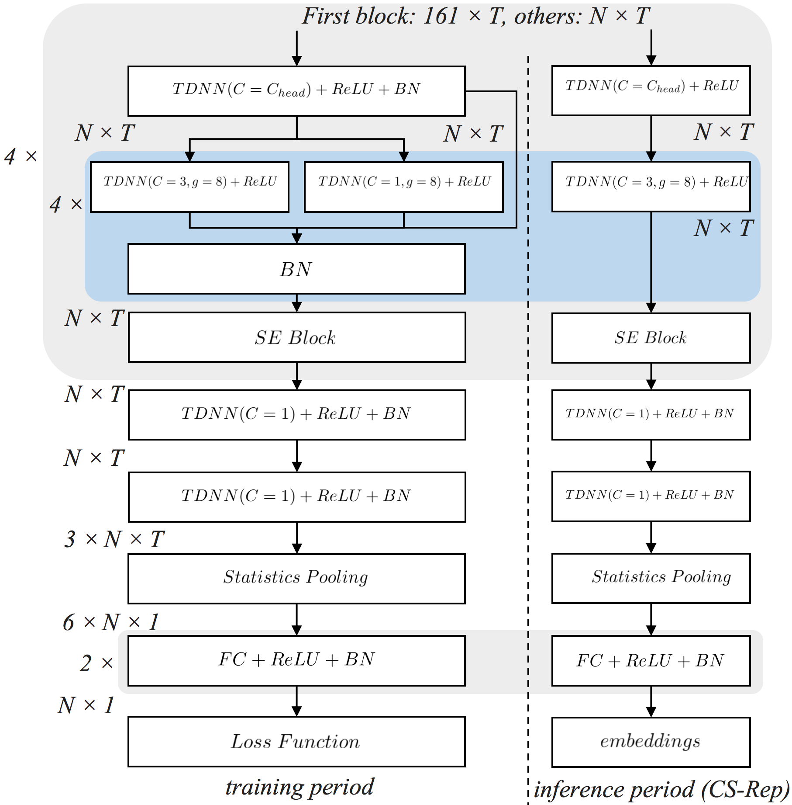
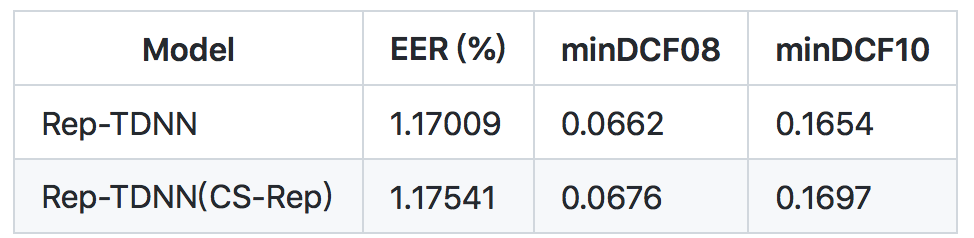

# CS-Rep

Our paper has been accepted by ICASSP-2022.

## Introduction

We proposed a novel re-parameterization strategy called cross-sequential re-parameterization (CS-Rep). This method can be used to increase the inference speed and verification accuracy of models, especially for the model with the "conv-activation-bn" structure. Based on the proposed approach, the training-period network utilizes a multi-branch topology to capture speaker information, whereas the inference-period model converts to a time-delay neural network (TDNN)-like plain backbone with stacked TDNN layers to achieve the fast inference speed. Specifically, we build a multi-branch network with the "conv-activation-bn" structure during the training period. In the inference period, CS-Rep adjusts the order of modules of the sequential layer to the "bn-conv-activation"  lossless, causing the BN to be adjacent to the convolutional layer. However, the "bn-first" case will generate influences on each channel of the convolutional layer. We propose the "bn-first" re-parameterization method to model these influences by the discrete convolution operator. Then, CS-Rep adopts this approach to convert the multi-branch network to a TDNN-like plain topology while maintaining the multi-scale information capturing. Therefore, the model adopted CS-Rep achieves an efficient architecture with friendly parallel computing. The strategy of CS-Rep can be adopted in other ASV models to increase the accuracy and inference speed.

In this work, we adopted the proposed CS-Rep to build a novel TDNN called Rep-TDNN. It achieved state-of-the-art performance while maintaining fast inference speed. 


<center>
    
    <br>
    <div style="color:orange; border-bottom: 1px solid #d9d9d9;
    display: inline-block;
    color: #999;
    padding: 2px;">Fig. 1: The topology changes for our model when adopting the proposed CS-Rep: (a) original topology of model, (b) step, (c) steps 2 and 3, and (d) step 4.</div>
</center>


<center>
    
    <br>
    <div style="color:orange; border-bottom: 1px solid #d9d9d9;
    display: inline-block;
    color: #999;
    padding: 2px;">Fig. 2:The topologies of Rep-TDNN without and with CS-Rep. (Left): The multi-branch design in the training period. (Right): The plain topology in the inference period.</div>
</center>

## Requirement

PyTorch>=1.2.0

Cuda>=10.0

## Examples
Firstly, run the path.sh. 
```Bash
. ./path.sh
```

### inference speed comparing

A demo of the inference speed test for Rep-TDNN. The inference speed margin of used CS-Rep or not will increase with the increasing of  the performance of the device. 
```Bash
python3 comparing_cs_rep.py 
```


### sid inference comparing
Run the Rep-TDNN with CS-Rep to inference. Kaldi will be used in script to calculate scores.
```Bash
python3 sid_inference_cos.py  --trials trials  --checkpoint trained_model/net.pth  --feature-path /data1/data_fbank/voxceleb1/test --feature-type wav  --gpu-id "0"  --output ./  --rep True
```


### results
The results of Rep-TDDN on VoxCeleb1 test set without AS-Norm. Note that we not use any data augmentation for the paper.
<center>
    
    <br>
    <div style="color:orange; border-bottom: 1px solid #d9d9d9;
    display: inline-block;
    color: #999;
    padding: 2px;"></div>
</center>

The score file of the models in the table are given in this program ("rep_tdnn_demo/score/cos_score.score.original" and "rep_tdnn_demo/score/cos_score.score.cs-rep"). The code for getting EER, minDCF08, and minDCF10 are as following:
```Bash
paste -d  ' ' trials rep_tdnn_demo/score/cos_score.score.original  | awk -F ' ' '{print$6,$3}' | compute-eer  -
sid/compute_min_dcf.py --c-miss 10  --p-target 0.01  rep_tdnn_demo/score/cos_score.score.original trials
sid/compute_min_dcf.py --p-target 0.001  rep_tdnn_demo/score/cos_score.score.original trials

paste -d  ' ' trials rep_tdnn_demo/score/cos_score.score.cs-rep  | awk -F ' ' '{print$6,$3}' | compute-eer  -
sid/compute_min_dcf.py --c-miss 10  --p-target 0.01  rep_tdnn_demo/score/cos_score.score.cs-rep trials
sid/compute_min_dcf.py --p-target 0.001  rep_tdnn_demo/score/cos_score.score.cs-rep trials

```


