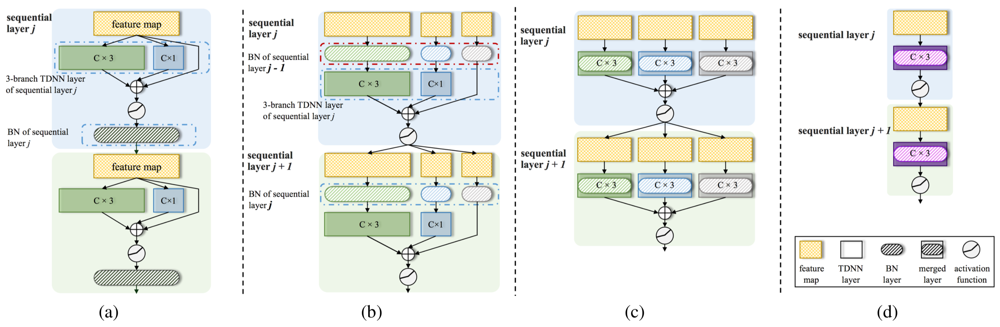

# CS-Rep

## Introduction

We proposed a novel re-parameterization strategy called cross-sequential re-parameterization (CS-Rep). This method can be used to increase the inference speed and verification accuracy of models, especially for the model with the "conv-activation-bn" structure. Based on the proposed approach, the training-period network utilizes a multi-branch topology to capture speaker information, whereas the inference-period model converts to a time-delay neural network (TDNN)-like plain backbone with stacked TDNN layers to achieve the fast inference speed. Specifically, we build a multi-branch network with the "conv-activation-bn" structure during the training period. In the inference period, CS-Rep adjusts the order of modules of the sequential layer to the "bn-conv-activation"  lossless, causing the BN to be adjacent to the convolutional layer. However, the "bn-first" case will generate influences on each channel of the convolutional layer. We propose the "bn-first" re-parameterization method to model these influences by the discrete convolution operator. Then, CS-Rep adopts this approach to convert the multi-branch network to a TDNN-like plain topology while maintaining the multi-scale information capturing. Therefore, the model adopted CS-Rep achieves an efficient architecture with friendly parallel computing. The strategy of CS-Rep can be adopted in other ASV models to increase the accuracy and inference speed.

In this work, we adopted the proposed CS-Rep to build a novel TDNN called Rep-TDNN. It achieved state-of-the-art performance while maintaining fast inference speed. 

<table>
<tr>
<td>

 
The changes of topology for a multi-branch model when adopting CS-Rep.

</td>
</tr>
</table>

## Examples